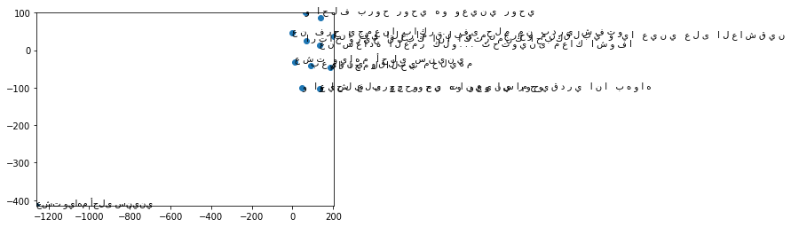

# Sentence Embeddings on Arabic Song Lyric

In this work, I trained the Arabic Song Lyric sentence-level embeddings with the Fast Sentence Embedding (FSE) library by [Oliver Borchers](https://github.com/oborchers/Fast_Sentence_Embeddings/blob/master/README.md) using the [AraVec](https://github.com/bakrianoo/aravec/tree/master/AraVec%202.0) pre-trained embeddings built from this [Arabic Wikipedia dump](https://dumps.wikimedia.org/arwiki/latest/arwiki-latest-pages-articles.xml.bz2).

The code applied the Smooth Inverse Frequency (SIF) implementation described in the paper [*A Simple but Tough-To-Beat Baseline for Sentence Embeddings*](https://openreview.net/forum?id=SyK00v5xx).

This code depends on <code>fse</code>, <code>nltk</code>, and <code>gensim</code> to run. Details of how to download and install them will be on the links above. 

## Imports


```python
# data preparation
from fse import SplitIndexedList

# for sentence embedding model training
from fse.models.average import FAST_VERSION, MAX_WORDS_IN_BATCH

# for Arabic sentence tokenisation
from nltk import sent_tokenize

# for loading word embeddings
from gensim.models import Word2Vec

# for sentence embedding with Smooth Inverse Frequency (SIF)
from fse.models import SIF

# for fun with scatter plots of similar lyrics
import matplotlib.pyplot as plt
```

## Loading dataset (i.e. song lyrics file)


```python
# I have earlier extracted only the lyrics from the file
textfile = "/home/ignatius/Desktop/new_projects/Mo/sample_lyrics_only.csv"
def read_input(input_file):
    with open(input_file,'r',encoding='utf8') as f:
        for i, line in enumerate(f):
            if sent_tokenize(line):
                yield sent_tokenize(line)
sentences = []
for sents in read_input(textfile):
    sentences.extend(sents)
s = SplitIndexedList(sentences)
```

### Viewing file size and top lines


```python
top = 3 #modify this value to see more or less...
print(len(s))
for i, sent in enumerate(s):
    if (i<top): print(sent)
    else: break
```

    131
    (['من', 'يوم', 'ماجيت', 'على', 'قلبى', 'ناديت', 'بهوالك', 'حسيت', 'فرحة', 'عينى'], 0)
    (['دا', 'انا', 'روحى', 'معاك', 'قلبى', 'بيهواك', 'وبعيش', 'وياك', 'كل', 'سنينى'], 1)
    (['والله', 'واحلوت', 'الايام', 'لما', 'حسيت', 'معاك', 'بغرام'], 2)


## Loading <code>AraVec</code> pre-trained embedding


```python
# I downloaded and extracted it before this...
print("Be patient...this might take a while...", end="")
model_path = "/home/ignatius/Desktop/new_projects/Mo/AraSIF-master/models/full_grams_sg_300_wiki.mdl"
model = Word2Vec.load(model_path)
print("Model successfully loaded!")
```

    Be patient...this might take a while...Model successfully loaded!


## Training sentence embedding


```python
# Just to confirm that MAX_WORDS_IN_BATCH=1000; FAST_VERSION=1.
# Recommended values
print(f"MAX_WORDS_IN_BATCH = {MAX_WORDS_IN_BATCH}\nFAST_VERSION = {FAST_VERSION}")
```

    MAX_WORDS_IN_BATCH = 10000
    FAST_VERSION = 1


### Actual Training...
I think (please don't quote me :D) the returned tuple is the **number of sentences** (or lyric lines) and **vocabulary** of the lyric dataset i.e. number of the unique words that appeared in the dataset.


```python
sent_model = SIF(model, workers=2)
sent_model.train(s)
```


    (131, 486)


## Querying the sentence embedding
Some of the fun things you can do with the trained sentence embedding model.

### Check the embedding of a sentence
Remember a sentence here means a line of lyrics.

To do that, you can pass the original index number e.g. **<code>sent_model.sv[100]</code>** will show the embedding for the *100th* lyric line in the file i.e. 'حياة ان ايدينا يکون مشبوک مع بعض'

The dimension of the embedding is 300. In the example below, I rounded the embedding values to 5 decimal places and them displayed only the 50 values.


```python
print(len(sent_model.sv[100])) #shows embedding dimension
sent_model.sv[100].round(5)[:50] # round to 5dp and show top 50 
```

    300


    array([ 0.04721, -0.10034,  0.1144 ,  0.04351, -0.01721,  0.01096,
           -0.0762 ,  0.07382, -0.00653,  0.01494,  0.04307, -0.01992,
           -0.00725, -0.15728,  0.08365,  0.02966,  0.03772, -0.01305,
            0.10484, -0.03358,  0.00907, -0.01134,  0.07196, -0.05996,
            0.02376,  0.06491, -0.08328, -0.01259,  0.04557,  0.03488,
           -0.1112 , -0.09199,  0.08961,  0.01582, -0.13587, -0.04426,
           -0.0537 ,  0.08918,  0.11185,  0.02721, -0.01495,  0.0381 ,
           -0.09987, -0.0154 , -0.00196,  0.05881, -0.00799, -0.01295,
           -0.07948, -0.01682], dtype=float32)


### Check `similarity` and `distance` between lyrics


```python
lyric_a, lyric_b = 6, 5 #vary these values to test
print(f"lyric_a: {' '.join(s[lyric_a][0])}\nlyric_b: {' '.join(s[lyric_b][0])}")
print(f"Similarity: {sent_model.sv.similarity(lyric_a, lyric_b).round(3)}")
print(f"Distance: {sent_model.sv.distance(lyric_a, lyric_b).round(3)}")
```

    lyric_a: كان ليا دا فين ياملينى حنين ياحبيب العين قول بصراحة
    lyric_b: اعمل ايه قلبى فيك بيدوب دا مش مكتوب عليه اختار
    Similarity: 0.1599999964237213
    Distance: 0.84


### Check the most similar lyrics `by_word`


```python
sent_model.sv.similar_by_word("عيني", wv=sent_model.wv, indexable=s.items)
```


    [('ذكراهم متفاركـ عيني', 26, 0.5853458642959595),
     ('انا في الغرام قلبي من جرحو من قلبي و يا عيني على العاشقين',
      65,
      0.3093312382698059),
     ('و احلف بروح روحي هو و عيني و روحي', 68, 0.3081241250038147),
     ('و عيون حبيبي يا هوى علي مش راضين', 62, 0.18106195330619812),
     ('و اروح و اشكي لمين جرح الحبيب جرحين', 67, 0.16696017980575562),
     ('كان ليا دا فين ياملينى حنين ياحبيب العين قول بصراحة',
      6,
      0.15186548233032227),
     ('و روح و اشكي لمين جرح الحبيب جرحين', 72, 0.1416168063879013),
     ('بعيوني وقلبي مخليهم', 30, 0.13992837071418762),
     ('ارتاح وريح قلبك انا اكثر منك احبك', 16, 0.09806551784276962),
     ('يا دمعتي و جروحي قوليلو قلبك فين', 74, 0.09768706560134888)]


### Check the most similar lyrics `by_sentence`


```python
sent_model.sv.similar_by_sentence("من يوم ماجيت على قلبى ناديت بهوالك حسيت فرحة عينى".split(), model=sent_model, indexable=s.items)
```


    [('من يوم ماجيت على قلبى ناديت بهوالك حسيت فرحة عينى', 0, 1.0000001192092896),
     ('لو يوم عييني قالو جرحي بيحلالو بعشق عذابي معاه', 70, 0.42464742064476013),
     ('بگو دوست دارم بهم بگو', 114, 0.27726486325263977),
     ('عزيزم بگو چت شده و چرا فکرم رو مشغول کردي', 126, 0.24750155210494995),
     ('نار الفراق نارهم و يامين يصبربهم على كل دمعة عين', 66, 0.2425152063369751),
     ('ما ينسى ولا يخلف الأماني', 45, 0.21340115368366241),
     ('ستاره گفتم آره بگو دوست داري', 89, 0.17496389150619507),
     ('عن محبه طويلة بينا ... العمر ماعشنا خوفا', 57, 0.1707918792963028),
     ('و اروح و اشكي لمين جرح الحبيب جرحين', 67, 0.16695822775363922),
     ('(ايراني) زندگي تا دست به دست هميم', 99, 0.16644954681396484)]


### Scatterplot of similar lyrics


```python
def show_closest_lyric_scatterplot(lyric_index):
    arr = np.empty((300), dtype='f')
    lyric, index = lyric_index
    labels = [" ".join(lyric)]
    
    # get close lyrics
    close_lyrics = sent_model.sv.similar_by_sentence(lyric, model=sent_model,indexable=s.items)
    
    # add the vector for each of the closest words to the array
    arr = np.vstack((arr, sent_model.sv[index]))
    
    for line, index,_ in close_lyrics:
        lyric_vector = sent_model.sv[index]
        labels.append(" ".join(line))
        arr = np.vstack((arr, np.array(lyric_vector)))
    
    # find tsne coords for 2 dimensions
    tsne = TSNE(n_components=2, random_state=0)
    np.set_printoptions(suppress=False)
    Y = tsne.fit_transform(np.nan_to_num(arr)) 
    x_coords = Y[:, 0]
    y_coords = Y[:, 1]
    # display scatter plot
    plt.scatter(x_coords, y_coords)
    
    for label, x, y in zip(labels, x_coords, y_coords):
        plt.annotate(label, xy=(x, y), xytext=(0, 0), textcoords='offset points')
    plt.xlim(x_coords.min()+0.00005, x_coords.max()+0.00005)
    plt.ylim(y_coords.min()+0.00005, y_coords.max()+0.00005)
    plt.show()
show_closest_lyric_scatterplot(s[25]) #change value to alter plots
```





### Save embedding model for later
The full model can be saved as below:


```python
sent_model.save('sent_full_model')
```

Or maybe as a text file as follows


```python
def save_model_as_text_file(model, filename):
    with open(filename, 'w', encoding='utf8') as outputfile:
        for sent, i in s:
            sent = " ".join(sent)
            vecs = " ".join(str(v) for v in model.sv[i].round(4))
            outputfile.write(f"{sent} {vecs}\n")
save_model_as_text_file(sent_model,'sent_model.txt')
```


```python
for sent, i in s:
    print(" ".join(sent))
```

    من يوم ماجيت على قلبى ناديت بهوالك حسيت فرحة عينى
    دا انا روحى معاك قلبى بيهواك وبعيش وياك كل سنينى
    والله واحلوت الايام لما حسيت معاك بغرام
    اد اما اقدر هكون وياك فى حضن هواك وان
    لو تغيب عن عنيا احتار ببقى عايشة وكانى فى نار
    اعمل ايه قلبى فيك بيدوب دا مش مكتوب عليه اختار
    كان ليا دا فين ياملينى حنين ياحبيب العين قول بصراحة
    ومسلمة ليك وبنادى عليك بطمن بيك ليك مرتاحة
    انسى ولا تعذب قلبك صدقني الحب يتعبك
    ما اريدك ياابن الناس ترجع مجروح احساس
    تشكيلي الحب معذبك انسى ولا تعذب قلبك
    الحب سهرني ليلي ما تدري سوه بحالي
    كتلك منخوفي عليك ابعد الله يخليك
    ليش تحب الميحبك انسى ولا تعذب قلبك
    دمرت اعصابك اني وعرفت اشكد تهواني
    لا تبجي ولا تنهار ولا تفكر بالي صار
    ارتاح وريح قلبك انا اكثر منك احبك
    أحبـــاب الروح
    أحباب الروح جرحوني
    راحوا لبعيد وخلوني
    ظلموني ليش ظلموني
    ومنهم ياليلحرموني
    يا ليلي يا ليلييا ليلي يا ليلي
    لومر الليل يواسيني
    ويحاول بلكيينسيني
    عشت وياهم أحلى سنيني
    ذكراهم متفاركـ عيني
    يا ليلي يا ليلييا ليلي يا ليلي
    كل لحظه تمر بطاريهم
    كذاب إلي كلكـناسيهم
    بعيوني وقلبي مخليهم
    دور بالروح تلكيهم
    يا ليلي ياليلي
    يا ليلي يا ليلي
    ربي خلق في الكون الاف والاف
    بس بحالاتك ما خلق حد ثاني
    اسمك على رسمك جميل وخطاف
    اسطورة وخلد حلاها الزمان
    نوره على مر الزمن غير ينشاف
    هيئه على هيئه يفوق الثمان
    سبحانه الله كيف ميز به اوصاف
    اوصاف يعجر عن ذكرها لساني
    آيه من الخالق بها اصناف واصناف
    من روعة الدنيا وحور الجنان
    حتى اسمها دوم عـ البال رفاف
    ما ينسى ولا يخلف الأماني
    انت ما قتلى لي... كلمتنى عيونى
    عن مشاعر صادقة حية ... نابعة من اعماق شجونك
    انت ماقتلى لي ... كلمتنى عيونى
    عن حنين يغمر مسامك... فى حنايا روح سكونك
    انت ما قتلى لي... كلمتنى عيونى
    عن كلام فى لسانك انت .... قبل ما يتقال عرفتو
    عن امانى جميلة زيك.... عن امل جواى عشتو
    عن فرح يجمعنا باكر... فى حلم من بدرى شفتو
    الالما تقول تصارحي... تهربا الكلمات تخونك
    انت ماقتلى ... كلمتنى عيونى
    عن سعادة العمر كلو... تحتوينى معاك اشوفا
    عن محبه طويلة بينا ... العمر ماعشنا خوفا
    ماكلام روعة عيونك... حلوة كلماتو حروفا
    برضى بيك أنا لسة هايم... مابحس فرحة دونك
    انت ماقتلى ... كلمتنى عيووووووونك
    الله كريم يا هوى و بيرضى على العاشقين
    و عيون حبيبي يا هوى علي مش راضين
    و احلف بروح روحي هو وعيني روحي
    يا دمعتي و جروحي قوليلو قلبك فين
    انا في الغرام قلبي من جرحو من قلبي و يا عيني على العاشقين
    نار الفراق نارهم و يامين يصبربهم على كل دمعة عين
    و اروح و اشكي لمين جرح الحبيب جرحين
    و احلف بروح روحي هو و عيني و روحي
    يا دمعتي و جروحي قوليلو قلبك فين
    لو يوم عييني قالو جرحي بيحلالو بعشق عذابي معاه
    و اعيش على جرحو من تانيو اسامحو قدري انا بهواه
    و روح و اشكي لمين جرح الحبيب جرحين
    و احلف بروح روحي هو وعيني روحي
    يا دمعتي و جروحي قوليلو قلبك فين
    انت ياغالى خدت روحى منى
    عزيز روحم رو ازم گرفتي
    ليك سنين عمرى وحياتى
    سالهاي زندگي و عمرم مال توست
    عمرى كله ليك
    تمام عمرم مال تو
    قلبى ياغالى انت خدته منى
    دلم ،عزيز، دلم رو بردي
    يبقى ليه اعيش حياتى
    ديگه چرا به زندگيم ادامه بدم
    ليه اعيش بعديك
    چرا بعد از تو زندگي کنم
    (ايراني) با تو همه چيزي قشنگي داره
    وياک کل شي حلو
    ستاره گفتم آره بگو دوست داري
    نجمة قلتک بلي قل انک تحبني
    يعنى من انهاردة قلبى ملك ايديك
    يعني از امروز دلم مال توست
    هتسيبه تانى كده ليه
    چرا دوباره اينطوري ولش مي کني
    قلبى من انهاردة قلبى ملك ايديك
    دلم ، از امروز دلم مال توست
    هتسيبه تانى كده ليه
    ديگه چرا دوباره اينطوري ولش کني
    (ايراني) زندگي تا دست به دست هميم
    حياة ان ايدينا يکون مشبوک مع بعض
    به اين ميگن عاشقي
    هذا يسمونه الحب
    انت ياغالى خدت روحى منى
    عزيز جونم رو ازم گرفتي
    ليك سنين عمرى وحياتى
    زندگي و عمرم مال تو
    عمرى كله ليك
    تمام عمرم مال تو
    كلمة واحدة من شفايفك انت
    يک کلمه از لبات
    كلمة واحدة قولها
    يک کلمه ست اونو بگو
    قول بحبك انت قولها ليا
    بگو دوست دارم بهم بگو
    قلبى ياما قالها
    دلم هم خيلي گفتش
    (ايراني) چشم تو چه گيراست
    عيونک معجبه
    عاشقي چه زيباست
    ما اجمل الحب
    تنها مرد من تويي تو دنيا در تموم لحظه ها
    انت في الکون و في کل اللحظات رجلي الوحيد
    كلمة واحدة هيا يلا قولها ليا
    فقط يک کلمه ست يالا بهم بگو
    ياحبيبى قولى ايه جرالك ليه شاغلى بالى
    عزيزم بگو چت شده و چرا فکرم رو مشغول کردي
    يعنى من انهاردة قلبى ملك ايديك
    يعني از امروز دلم مال توست
    هتسيبه تانى كده ليه
    ديگه چرا دوباره ولش مي کني

